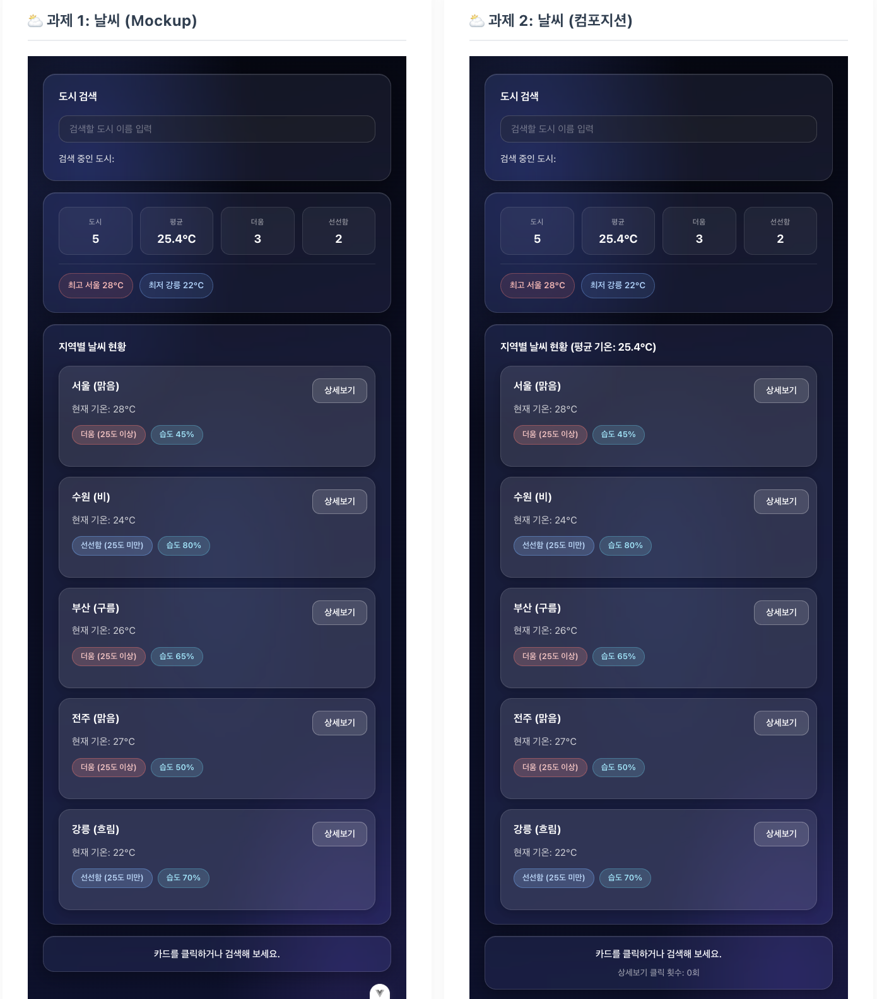
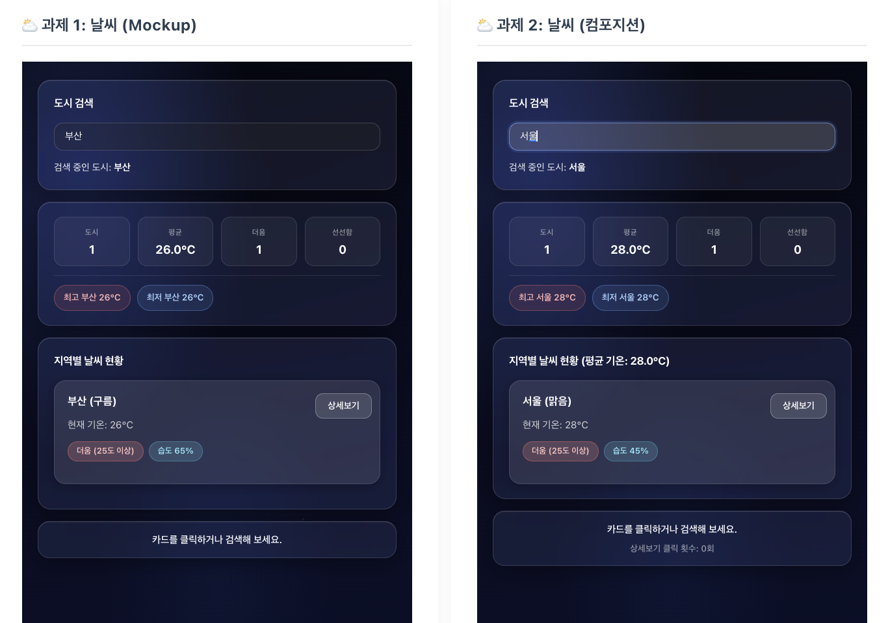
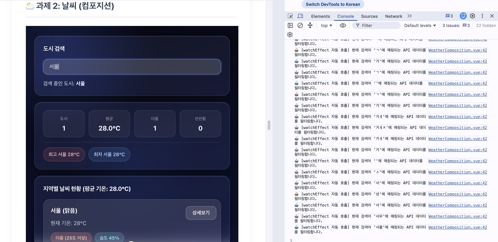
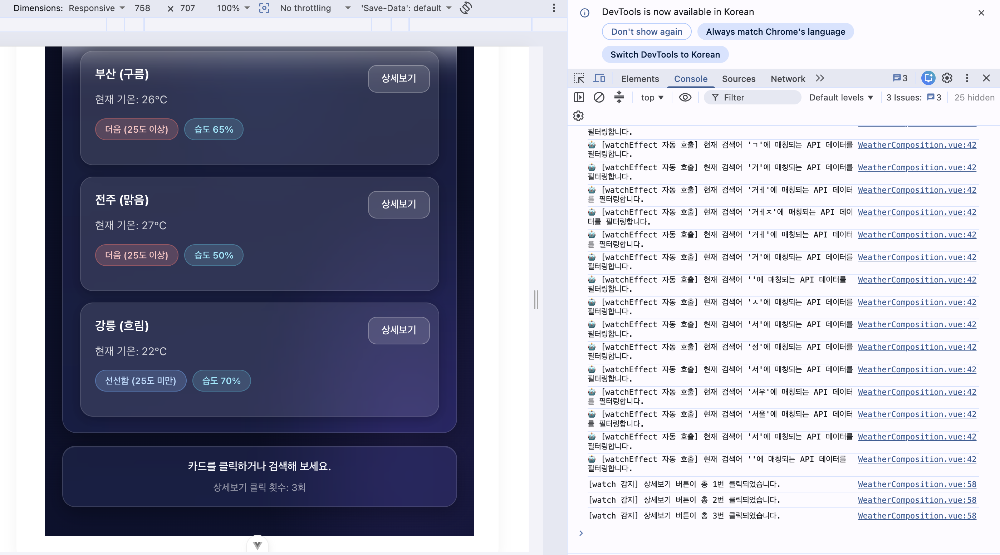
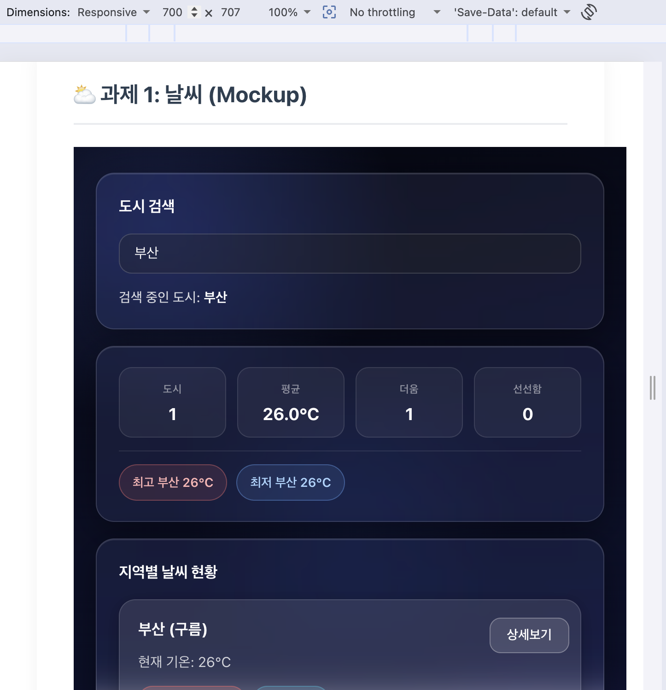
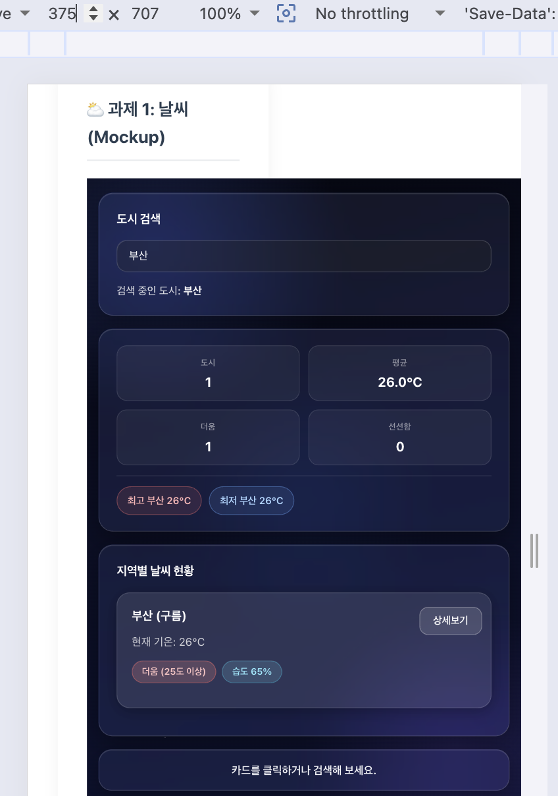

# 울산4반 Vue 2일차 종합실습 제출 - 박연제

## 제출 개요

- 반: 울산4반
- 제출자: 박연제(U116)
- 제출일: 2026-08-11
- 제출 항목: Weather Mockup, Weather Composition

## 실행 방법

\`\`\`
npm install
npm run dev
\`\`\`

## 프로젝트 구조

\`\`\`
src/
├─ components/
│ └─ exercise/
│ ├─ WeatherMockup.vue
│ └─ WeatherComposition.vue
└─ assets/
└─ weather-dashboard.css (두 컴포넌트 공통 스타일)
\`\`\`

## 1. Weather Mockup (WeatherMockup.vue)

### 기본 요구사항 대응

- 개인 도시 데이터 추가: 기존 3개 도시(서울, 수원, 부산)에 전주, 강릉 2개 도시를 추가하고, 전체 도시에 humidity(습도) 필드를 추가함
- computed(filteredWeatherList)로 검색어에 따른 실시간 필터링을 구현하고, v-show(isCityVisible)로 필터링 결과에 따라 카드 표시 여부를 제어함
- 카드 클릭 시 selectedCityInfo를 갱신하여 하단 상태 바에 반영함
- 기온 조건(25도 기준)에 따라 더움/선선함 뱃지를 분기 처리하고, 습도 뱃지를 추가로 표시함

### 개인 추가 구현

- summary-box 영역 추가: computed로 총 도시 수(totalCityCount), 평균 기온(summaryAverageTemp), 더움/선선함 도시 수(hotCityCount, coolCityCount)를 계산하여 요약 통계로 표시함
- computed(hottestCity, coolestCity)로 필터링된 목록 내 최고/최저 기온 도시를 계산하여 pill 형태로 표시함
- 검색 결과가 없을 경우 안내 문구(empty-result)를 노출함

## 2. Weather Composition (WeatherComposition.vue)

### 기본 요구사항 대응 (Composition API)

- ref: weatherList, searchQuery, selectedCityInfo, detailViewCount를 반응형 상태로 관리함
- computed: filteredWeatherList(검색 필터링), averageTemp(평균 기온)를 연산하여 의존성이 바뀔 때만 재계산되도록 함
- watch: selectedCityInfo의 변경을 감지하여 콘솔에 로그를 출력함
- watchEffect: searchQuery를 자동으로 추적하여 검색어가 바뀔 때마다 콘솔에 API 필터링 시뮬레이션 로그를 출력함

### 개인 추가 구현

- detailViewCount ref를 추가하고, 상세보기 버튼 클릭 시 값을 증가시킨 뒤 watch로 감지하여 클릭 횟수를 콘솔에 로그로 남김
- averageTemp computed를 목록 영역 제목에 실시간으로 표시함
- Mockup과 동일한 로직으로 totalCityCount, hotCityCount, coolCityCount, hottestCity, coolestCity computed를 추가하여 요약 통계 및 최고/최저 기온 도시를 함께 표시함

## 디자인

- 두 컴포넌트의 스타일을 src/assets/weather-dashboard.css 하나로 분리하고, 각 컴포넌트의 `<style scoped>\`에서 @import하여 공유함
- 다크 네이비 그라디언트 배경과 블루 톤 광원을 배치하여 우주 테마 적용함
- 검색창, 요약 통계 박스, 날씨 카드, 상태 바를 모두 backdrop-filter 기반의 반투명 글래스모피즘 스타일로 통일함
- 카드/뱃지/버튼은 기본 상태에서 테두리를 옅게 하고, hover 시 테두리와 그림자가 강조되는 인터랙션을 추가함
- 560px 이하 화면에서는 요약 통계 grid를 2열로 재배치하는 반응형 처리를 포함함

## 스크린샷

### 실행 화면

Mockup / Composition 두 화면 모두 초기 상태(도시 5개, 요약 통계, 최고/최저 기온)가 정상적으로 렌더링되는 모습입니다.

### 검색 필터링 동작

Mockup에서 "부산", Composition에서 "서울"을 검색했을 때 computed(filteredWeatherList)로 실시간 필터링되어 요약 통계까지 함께 갱신되는 모습입니다.

### 상세보기 클릭 시 콘솔 로그 (watch / watchEffect)

검색어를 입력할 때마다 watchEffect가 자동으로 감지하여 API 필터링 로그를 출력합니다.

상세보기 버튼을 클릭할 때마다 detailViewCount가 증가하고, watch가 이를 감지하여 클릭 횟수 로그를 출력합니다.

### 반응형 화면

\`weather-dashboard.css\`에 \`@media (max-width: 560px)\` 규칙을 적용하여, 화면 너비가 560px을 넘을 때는 요약 통계(도시/평균/더움/선선함)가 4열로, 560px 이하일 때는 2×2로 재배치됩니다.

**700px (560px 초과) — 요약 통계 4열**

**375px (모바일 크기, 560px 이하) — 요약 통계 2×2로 전환**

