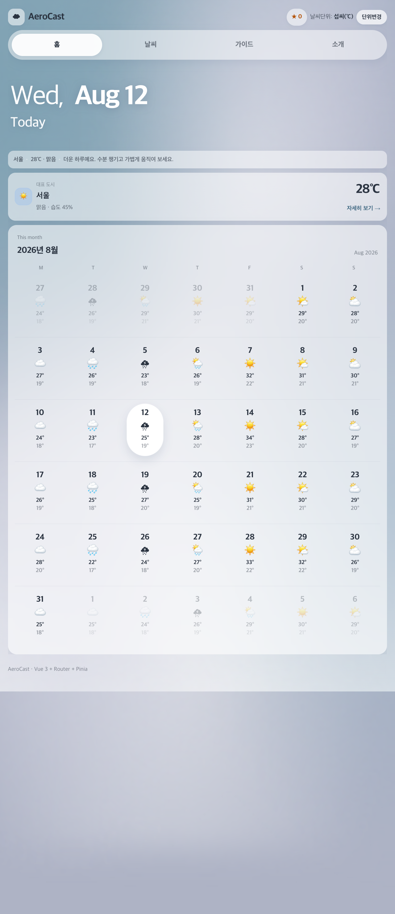
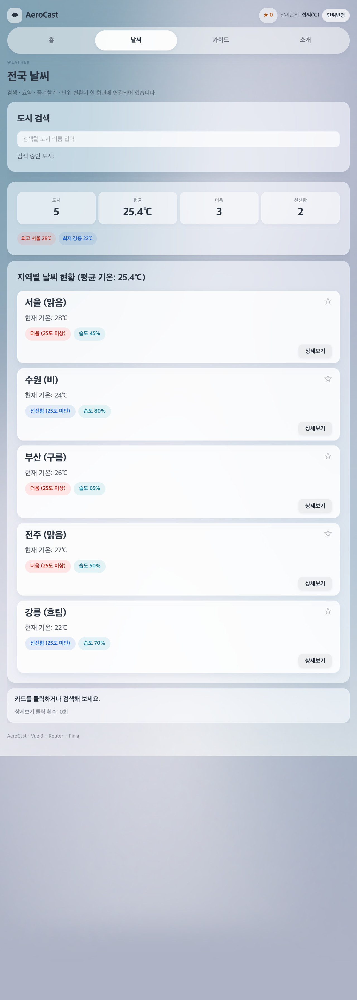
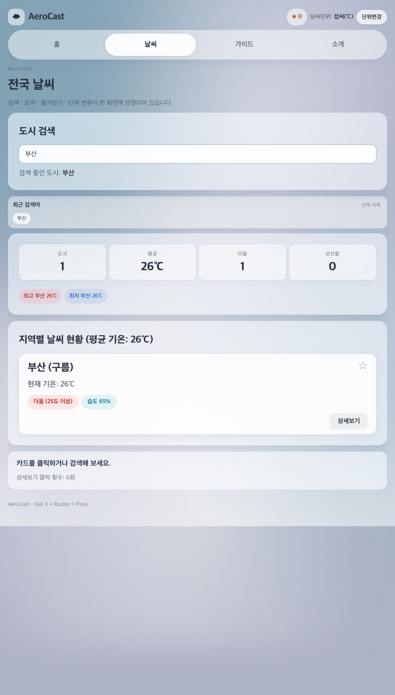
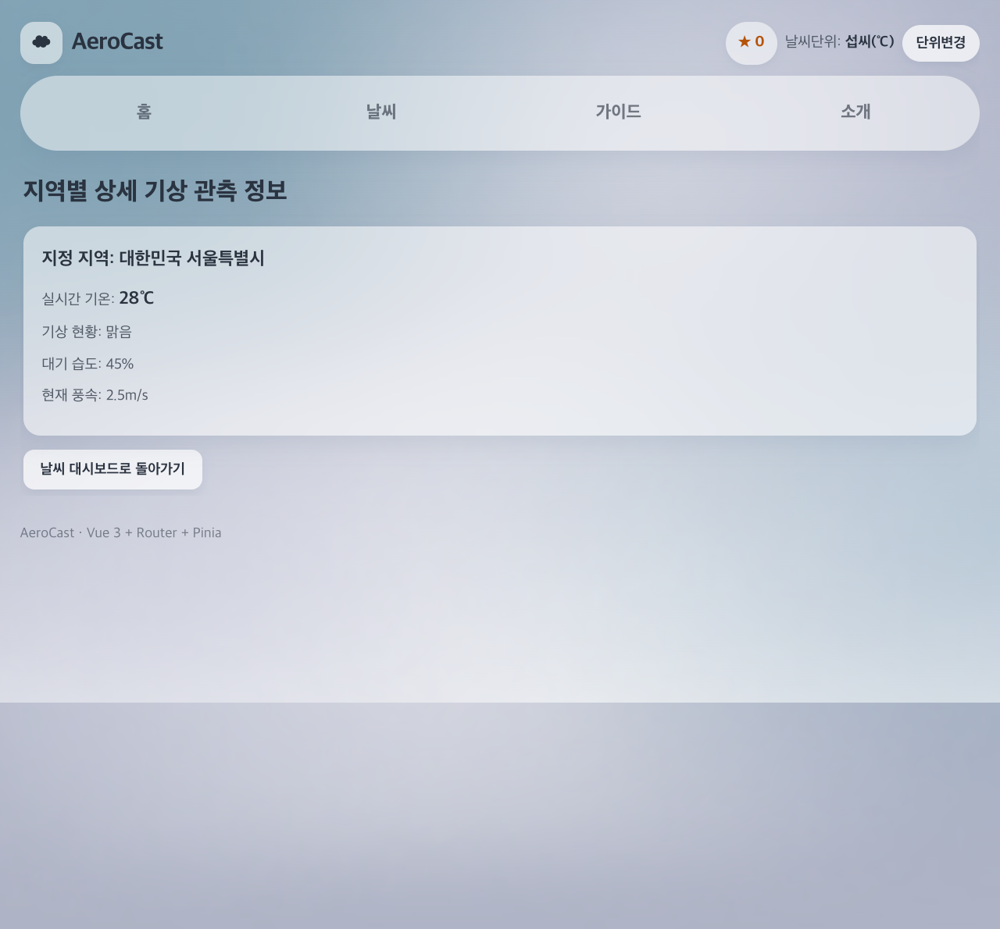
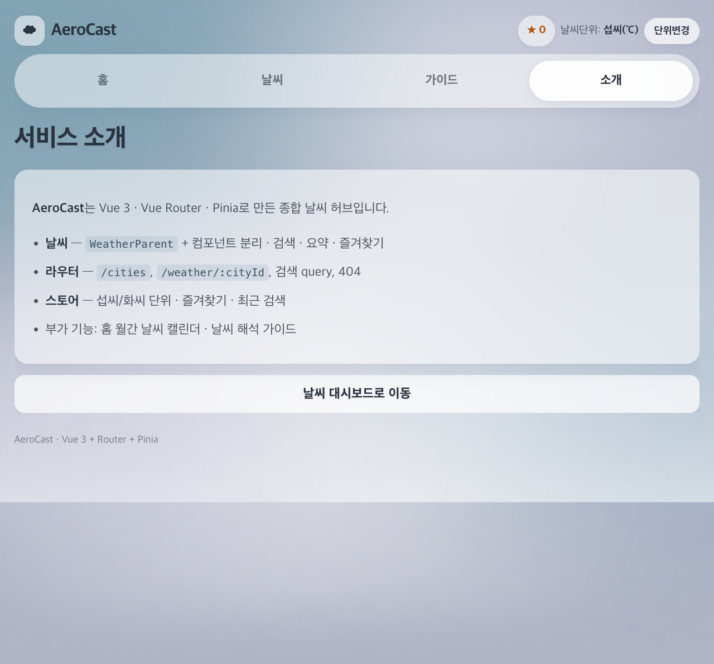
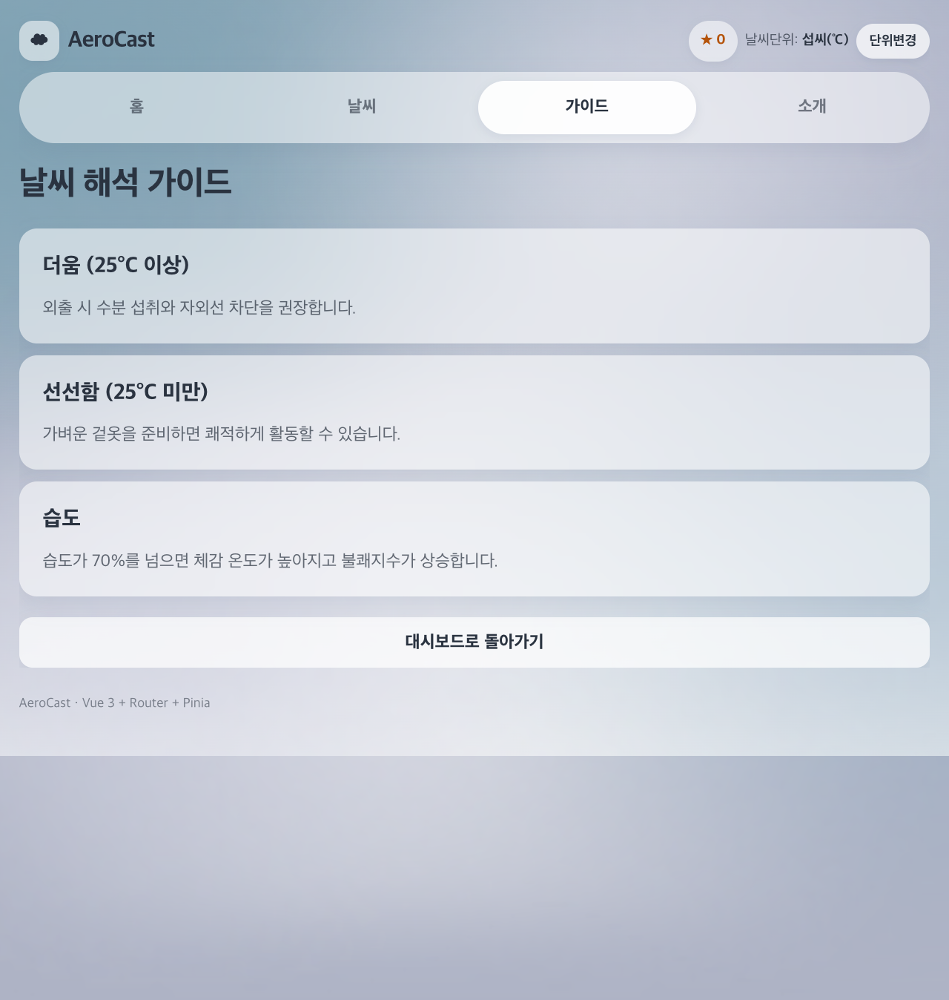
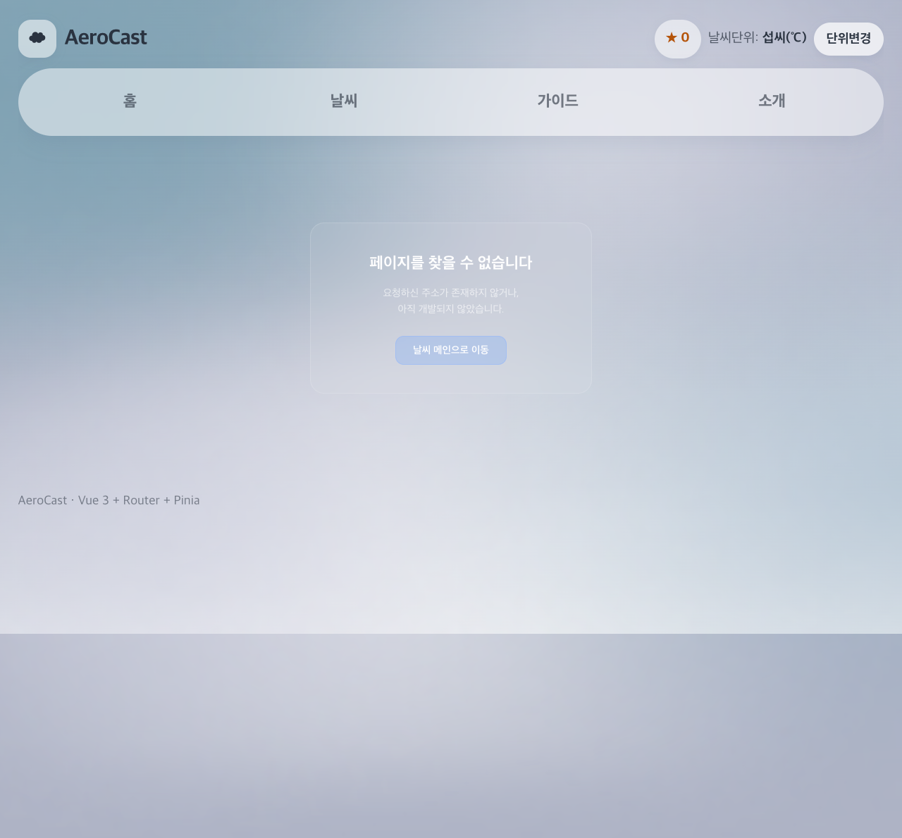
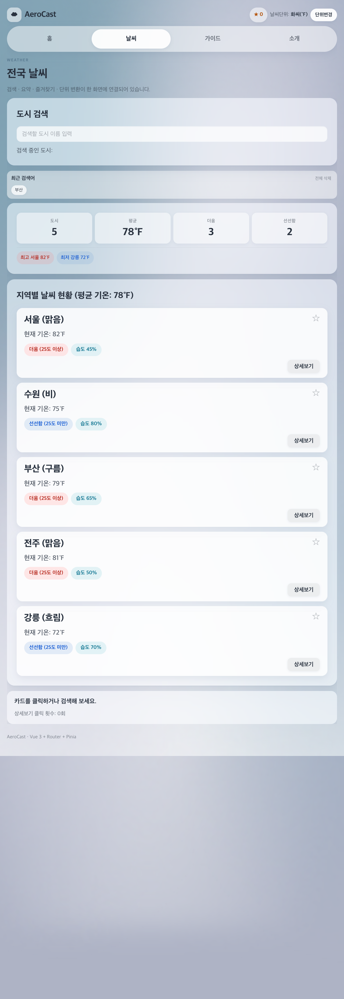
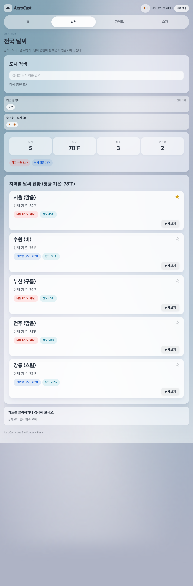

# 울산4반 Vue 3·4·5일차 종합실습 제출 - 박연제

## 제출 개요

- 반: 울산4반
- 제출자: 박연제(U116)
- 제출일: 2026-08-12
- 제출 항목: Component(3) · Router(4) · Pinia Store(5)
- 앱 이름: **AeroCast** (단일 날씨 허브로 통합)

> 2일차 README는 `README_day2_backup.txt`에 백업해 두었습니다.

## 실행 방법

```
npm install
npm run dev
```

브라우저에서 `http://localhost:3000/` (또는 터미널에 표시된 포트)로 접속합니다.

### 주요 URL

| 화면                              | 주소                           |
| --------------------------------- | ------------------------------ |
| 홈                                | `/`                            |
| 날씨 대시보드 (과제 3·4·5 실사용) | `/cities`                      |
| 도시 상세                         | `/weather/city_01` (서울 예시) |
| 서비스 소개                       | `/about`                       |
| 날씨 가이드 (본인 추가 View)      | `/guide`                       |
| 404                               | `/kk` 처럼 **없는 주소** 입력  |
| 1·2·3일차 원본 Lab                | `/lab/1`, `/lab/2`, `/lab/3`   |

## 프로젝트 구조 (과제 3·4·5 관련)

```
src/
├─ App.vue                          # 셸: RouterLink 네비 + UnitToggler + RouterView
├─ router/
│  └─ index.js                      # [4] 라우트 · Lazy Loading · Catch-all
├─ stores/
│  ├─ configStore.js                # [5] 섭씨/화씨 전역 단위
│  └─ weatherStore.js               # [5] 나만의 Store (즐겨찾기·최근 검색)
├─ composables/
│  └─ useDisplayTemp.js             # [5] 표시 온도 변환 composable
├─ utils/
│  └─ temperature.js                # ℃ → ℉ 변환 유틸
├─ components/
│  ├─ MonthWeatherCalendar.vue      # 홈 월간 캘린더 (제품 UI)
│  └─ exercise/
│     ├─ WeatherParent.vue          # [3] 부모 — 상태·로직 소유, 자식 조립
│     ├─ BaseDashboardCard.vue      # [3] slot 공통 카드 래퍼
│     ├─ SearchBar.vue              # [3] props/emit 검색창
│     ├─ WeatherCard.vue            # [3] props/emit 도시 카드 (+[5] 단위·즐겨찾기)
│     ├─ UnitToggler.vue            # [5] 단위 변경 버튼
│     ├─ StorePanel.vue             # [5] 최근 검색·즐겨찾기 패널
│     ├─ WeatherMockup.vue          # 1일차 원본 (/lab/1)
│     └─ WeatherComposition.vue     # 2일차 원본 (/lab/2)
└─ views/
   ├─ HubHomeView.vue               # 홈 (/)
   ├─ WeatherHomeView.vue           # [4] /cities — 안에서 WeatherParent 사용
   ├─ WeatherDetailView.vue         # [4] /weather/:cityId 상세
   ├─ WeatherAboutView.vue          # [4] /about
   ├─ WeatherGuideView.vue          # [4] 본인 추가 View /guide
   ├─ NotFoundView.vue              # [4] 404 + programmatic navigation
   └─ AssignmentDayView.vue         # /lab/:day Lab 껍데기
```

---

## 1. 과제 3 — Component (`src/components/exercise/`)

### 기본 요구사항 대응

- 과제 2 Composition의 로직을 유지한 채 UI를 **4개 컴포넌트**로 분리함
- **WeatherParent.vue**: `weatherList`, `searchQuery`, `filteredWeatherList`, `watch` / `watchEffect`, 요약 통계 등 상태·로직을 전부 소유하고 자식을 조립함
- **BaseDashboardCard.vue**: `<slot>`으로 검색/목록 영역을 감싸는 공통 레이아웃 래퍼
- **SearchBar.vue**: props `currentQuery` / emit `update-query`로 부모 `searchQuery`와 단방향 연동
- **WeatherCard.vue**: props `cityItem` / emit `select-card`, `click-detail`로 카드 선택·상세보기 이벤트 전달

### 실사용 연결

- 날씨 탭 `/cities` → `WeatherHomeView.vue`가 `WeatherParent`를 렌더링함 (목록 UI의 실제 본체)
- 상세보기 클릭 시 Parent가 `router.push('/weather/' + cityId)`로 이동 (과제 4와 연결)

### 개인 추가 유지

- 도시 5개(서울·수원·부산·전주·강릉) + `humidity`
- 요약 통계(도시/평균/더움/선선함) 및 최고·최저 기온 도시 pill
- 검색 결과 없음 안내, 상세보기 클릭 횟수 + watch 콘솔 로그

---

## 2. 과제 4 — Router (`src/router/index.js`, `src/views/`)

### 기본 요구사항 대응

| 경로               | View 파일               | 비고                      |
| ------------------ | ----------------------- | ------------------------- |
| `/`                | `HubHomeView.vue`       | 제품 홈 (즉시 로드)       |
| `/cities`          | `WeatherHomeView.vue`   | 날씨 대시보드 (Lazy)      |
| `/about`           | `WeatherAboutView.vue`  | 서비스 소개 (Lazy)        |
| `/weather/:cityId` | `WeatherDetailView.vue` | **동적 경로** 상세 (Lazy) |
| `/guide`           | `WeatherGuideView.vue`  | **본인 추가 View** (Lazy) |
| `/:pathMatch(.*)*` | `NotFoundView.vue`      | **404 Catch-all** (Lazy)  |

- **선언적 네비게이션**: `App.vue`의 `<RouterLink>` (홈 / 날씨 / 가이드 / 소개)
- **프로그래밍 네비게이션**: 상세보기 `router.push`, 404·소개 등의 “홈/대시보드로 이동” 버튼
- **검색 ↔ URL 쿼리 동기화**: `WeatherParent`에서 `?search=`를 `watch` + `onMounted`로 양방향 반영
- 상세보기의 `alert` 제거 → 페이지 이동으로 교체

### 404 화면 확인 방법

주소창에 **정의되지 않은 경로**를 입력하면 됩니다.

예: `http://localhost:3000/kk` 또는 `http://localhost:3000/abc`

→ `NotFoundView.vue`가 표시되고, **날씨 메인으로 이동** 버튼으로 홈(`/`)에 돌아갑니다.

### 선택·추가 구현

- `/guide` 날씨 해석 가이드 View 추가
- 제품형 허브 네비(AeroCast)로 과제 섹션을 하나로 통합 (과제 개념은 `/cities`·상세·스토어에 유지)

---

## 3. 과제 5 — Pinia Store (`src/stores/`, `UnitToggler` 등)

### 기본 요구사항 대응

- **configStore** (`src/stores/configStore.js`)
  - state: `unit` (`celsius` / `fahrenheit`)
  - getter: `unitSymbol` (℃ / ℉), `unitLabel`
  - action: `toggleUnit()`
  - localStorage에 단위 저장
- **UnitToggler.vue**: 헤더에 배치, 스토어 `toggleUnit` 호출
- **WeatherCard.vue** / **WeatherDetailView.vue**: 목록·상세 모두 동일 단위로 온도 표시
- 원본 `temp`는 섭씨 숫자 유지, 화면 표시만 변환
- 더움/선선함 뱃지는 원본 섭씨 25° 기준 유지

### 선택·자율 구현

- **weatherStore** (`src/stores/weatherStore.js`): 최근 검색어 · 즐겨찾기 도시 + localStorage
- **StorePanel.vue**: 날씨 화면에서 최근 검색/즐겨찾기 UI
- **useDisplayTemp.js**: 표시 온도 변환 composable로 분리
- 카드 ★ 버튼 및 헤더 즐겨찾기 개수 표시

---

## 디자인 / 제품 UI (추가)

- 단일 셸 `App.vue` + soft glass 라이트 테마 (`aurora-bg` 배경)
- 홈: 날짜 히어로 + 대표 도시 + **MonthWeatherCalendar** (이번 달 그리드, 오늘 흰색 캡슐, 날씨 이모지·기온 목데이터)
- 운세/게임 탭은 제거하고 날씨 중심으로 정리

---

## 스크린샷

> 아래 이미지는 `screenshots/` 폴더에 있습니다.  
> 캡처가 비어 있거나 최신이 아니면, README 하단 **직접 캡처 체크리스트**를 참고해 같은 파일명으로 덮어쓰면 됩니다.

### 홈 (AeroCast)

날짜 히어로와 월간 날씨 캘린더가 보이는 홈 화면입니다.



### 과제 3·4·5 통합 — 날씨 대시보드 (`/cities`)

`WeatherParent` + SearchBar / WeatherCard / BaseDashboardCard / StorePanel이 한 화면에 연결된 모습입니다.



### 검색 + URL 쿼리 (`?search=`)

검색어 입력 시 카드가 필터링되고, 주소에 `?search=`가 반영됩니다.



### 동적 경로 상세 (`/weather/:cityId`)

상세보기 클릭 후 도시별 상세 페이지입니다. 단위 변경 시 여기 온도도 함께 바뀝니다.



### 서비스 소개 / 가이드





### 404 (없는 URL)

주소창에 `/kk`처럼 없는 경로를 넣었을 때 Catch-all 404 화면입니다.



### 단위 변경 (섭씨 ↔ 화씨)

헤더 **단위변경** 후 목록 온도가 ℉로 바뀐 모습입니다.



### 즐겨찾기 (나만의 Store)

카드 ★ 토글 및 StorePanel / 헤더 즐겨찾기 수 반영입니다.



---

## 직접 캡처 체크리스트 (필요 시)

브라우저에서 `npm run dev` 후 아래를 캡처해 `screenshots/`에 저장하세요.

1. `/` → `d345-01-home.png`
2. `/cities` → `d345-02-cities.png`
3. `/cities`에서 `부산` 검색 → `d345-03-search-query.png` (주소창에 `?search=` 보이게)
4. 서울 상세보기 → `d345-04-detail.png`
5. `/about` → `d345-05-about.png`
6. `/guide` → `d345-06-guide.png`
7. `/kk` → `d345-07-404.png` ← **404는 이렇게 찾으면 됩니다**
8. 단위변경(℉) → `d345-08-unit-fahrenheit.png`
9. ★ 즐겨찾기 → `d345-09-favorite.png`
