# 울산4반 Vue 4일차 종합실습 제출 — 박연제

## 제출 개요

| 항목 | 내용 |
|------|------|
| 반 | 울산4반 |
| 제출자 | 박연제 (U116) |
| 제출일 | 2026-08-13 |
| 과제 | Vue 종합실습 (Component · Router · Pinia · Axios · UI 고도화 · 배포) |
| 앱 이름 | **AeroCast** |

> 3일차 README 원본은 `README_day3_backup.txt` 에 백업해 두었습니다.

---

## 배포 주소 (필수)

- **배포 URL (영구):** https://yeonjep.github.io/skala-vue/
- **소스 레포:** https://github.com/yeonjep/skala-vue
- 배포 방식: GitHub Pages (`main` 푸시 → Actions 자동 빌드/배포)

### 배포 메모 (교안: Build & Deployment)

1. `npm run build` → `dist/` 정적 파일 생성 ✅
2. GitHub Pages에 호스팅 ✅ (Vue Router용 `404.html` 폴백 포함)
3. **API 키는 Git에 올리지 않음** — `.env` / `.env.local`만 로컬·호스팅 환경변수로 설정
4. Groq 챗봇은 `VITE_GROQ_API_KEY`가 있을 때만 동작 (없으면 안내 UI 표시)

> 구글 드라이브/제출란에는 **https://yeonjep.github.io/skala-vue/** 를 붙여 넣으면 됩니다.  
> 첫 배포 직후 1~2분 정도 Actions 완료를 기다리면 접속됩니다.

---

## 실행 방법 (채점용)

```bash
# node_modules 없는 zip 기준
npm install
npm run dev
```

브라우저에서 `http://localhost:3000` 접속

### 품질 / 환경변수

```bash
npm run lint          # ESLint + oxlint
cp .env.example .env  # Groq 키는 여기만 (Git 제외)
```

---

## 주요 URL

| 화면 | 주소 |
|------|------|
| 홈 대시보드 | `/` |
| 전국 날씨 (과제 3·4·5 실사용) | `/cities` |
| 도시 상세 + 누비 캐릭터 | `/weather/:cityId` |
| 날씨 가이드 | `/guide` |
| 서비스 소개 | `/about` |
| Groq 챗봇 | `/chat` |
| 운동 뉴스 (ESPN) | `/sports` |
| 건강 관리 (wger) | `/health` |
| 404 | `/kk` 등 없는 주소 |
| Lab | `/lab/1` ~ `/lab/3` |

---

## 이번(4일차)에 추가·정교화한 내용

### 1) 홈 대시보드 고도화 (`HubHomeView`)

- Open-Meteo 기반 **현재 날씨 · 7일 예보 · Overview 차트 · 세계 지도 · 즐겨찾기 · 레이더**
- 카드 **드래그로 자리 교체** (레이아웃 `localStorage` 저장)
- macOS 스타일 **상세 팝업** (닫기 / 최소화 / 최대화)
- **7일 예보**: wttr.in 폴백이 3일만 주던 문제를 보완해 **항상 7일** 표시
- Overview 팝업: 그래프가 창 높이를 채우고, 찌그러지던 점을 **원형 점**으로 수정
- Current Weather: 기온을 **초대형 히어로 숫자**로 배치해 여백 활용

### 2) 월간 캘린더 (`MonthWeatherCalendar`)

- 시스템 이모지 → **통통하고 입체적인 SVG 날씨 아이콘** (`WeatherGlyph`)
- 날짜·기온 글자 크기 확대

### 3) 날씨 상세 + 캐릭터 누비 (`WeatherBuddy`)

- 온도·습도·불쾌지수·강수에 따라 **8~9가지 모션/표정**
- 상세 카드(기온·대기질) 타이포 확대

### 4) Axios + 외부 API

| API | 용도 |
|-----|------|
| Open-Meteo | 현재/예보/월간/대기질 (키 없음) |
| wttr.in | Open-Meteo 한도 시 폴백 |
| ESPN | `/sports` 축구 순위·스코어·뉴스 |
| wger.de | `/health` 운동 라이브러리 |
| Groq | `/chat` LLM 챗봇 (환경변수 키) |

### 5) 사이드 레일 (`HubSideRail`)

- 홈 / 챗봇 / 운동 뉴스 / 건강 관리
- 호버 시 펼침, **커서 이탈 시 자동 접힘**
- 드래그로 상·하·좌·우 도킹

### 6) UI/UX 다듬기

- 다크 배경에서 **제목 대비** 개선 (소개·가이드·전국 날씨)
- `/cities` 검색창 **세로 확대 + 입력 글자 확대**
- 건강·운동 페이지: 큰 타이포, 뉴스/운동 카드 **자동 스와이프**
- Element Plus · Leaflet · Axios · Pinia · Vue Router 조합

### 7) 수업 과제 핵심 유지 (3·4·5)

- **Component**: `WeatherParent` + SearchBar / WeatherCard / BaseDashboardCard / slot
- **Router**: Lazy Loading · `/weather/:cityId` · Catch-all 404 · `?search=` 동기화
- **Pinia**: `configStore`(℃/℉) · `weatherStore`(즐겨찾기·최근검색)

---

## 프로젝트 구조 (핵심)

```
src/
├─ App.vue / HubSideRail.vue
├─ api/          openMeteo · espnFootball · healthApi · groq
├─ components/
│  ├─ dashboard/   CurrentWeatherHero · SevenDayForecast · Overview …
│  ├─ weather/     WeatherBuddy · WeatherGlyph
│  └─ exercise/    WeatherParent · SearchBar · WeatherCard …
├─ stores/       configStore · weatherStore
├─ views/        HubHome · Weather* · Chatbot · Sports · Health …
└─ router/index.js
```

---

## 스크린샷 (채점용)

> 아래 이미지는 `screenshots/` 폴더에 있습니다.  
> 최신 UI 캡처 파일명: `d4-*.png` (캡처 스크립트: `scripts/capture-readme-day4.mjs`)  
> 캡처 전이면 기존 `d345-*.png` 를 참고용으로 함께 두었습니다.

### 1. 홈 대시보드

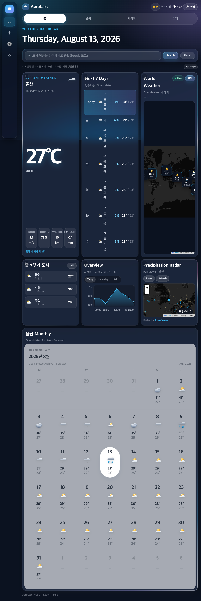

### 2. 전국 날씨 (`/cities`) — Component · Store 실사용

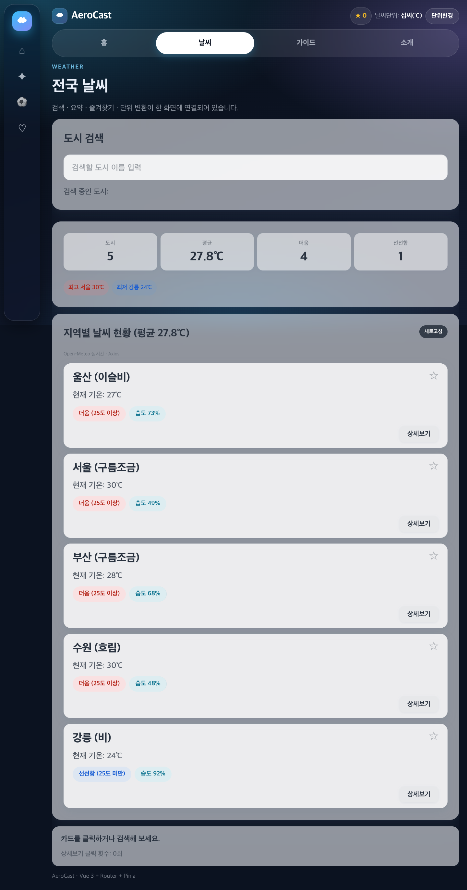

### 3. 검색 + URL 쿼리

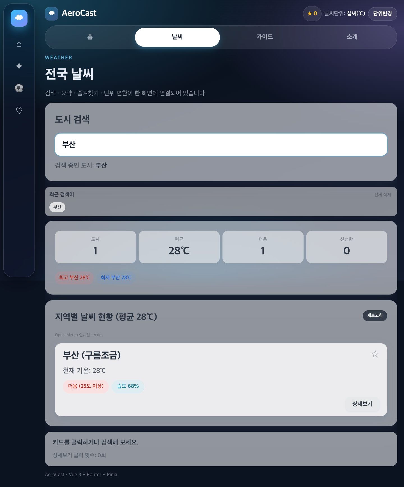

### 4. 도시 상세 + 누비

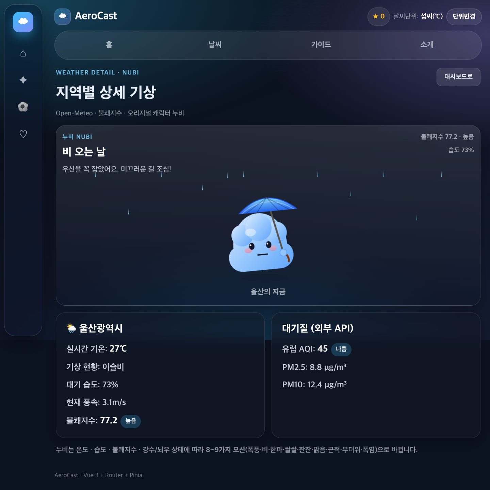

### 5. 소개 / 가이드

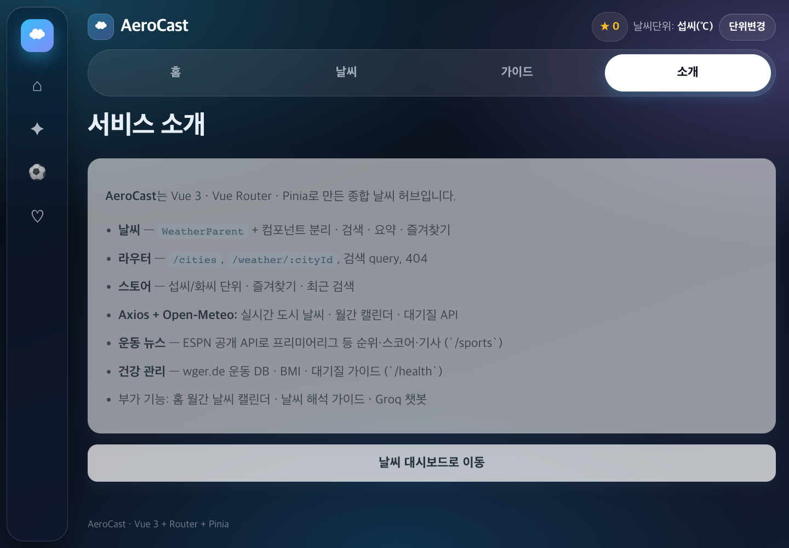

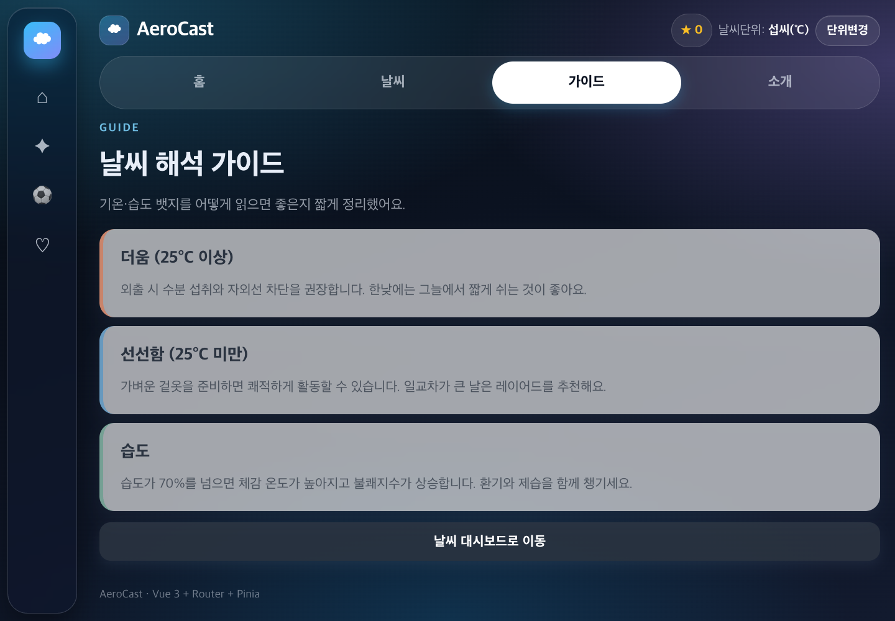

### 6. 운동 뉴스 (본인 아이디어)

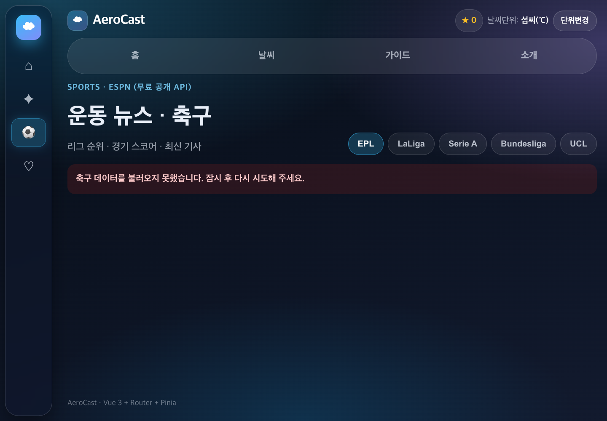

### 7. 건강 관리 (본인 아이디어)

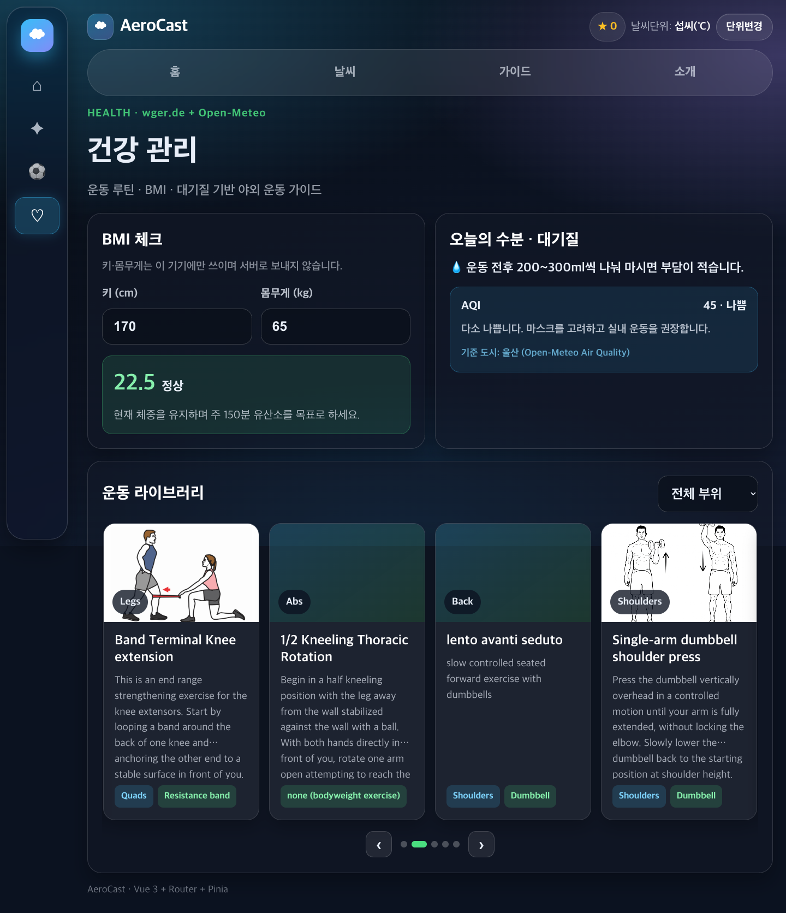

### 8. Groq 챗봇 (본인 아이디어)

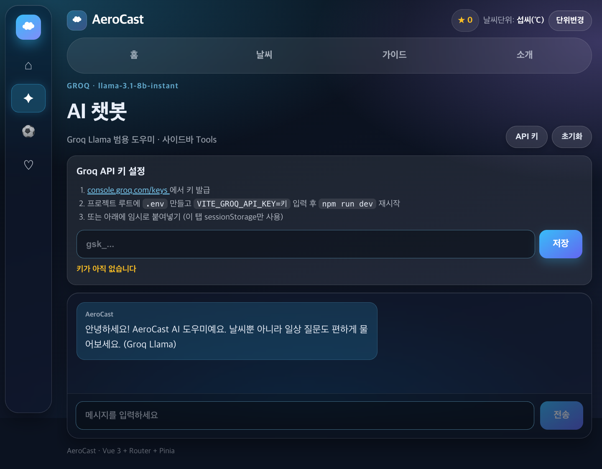

### 9. 404

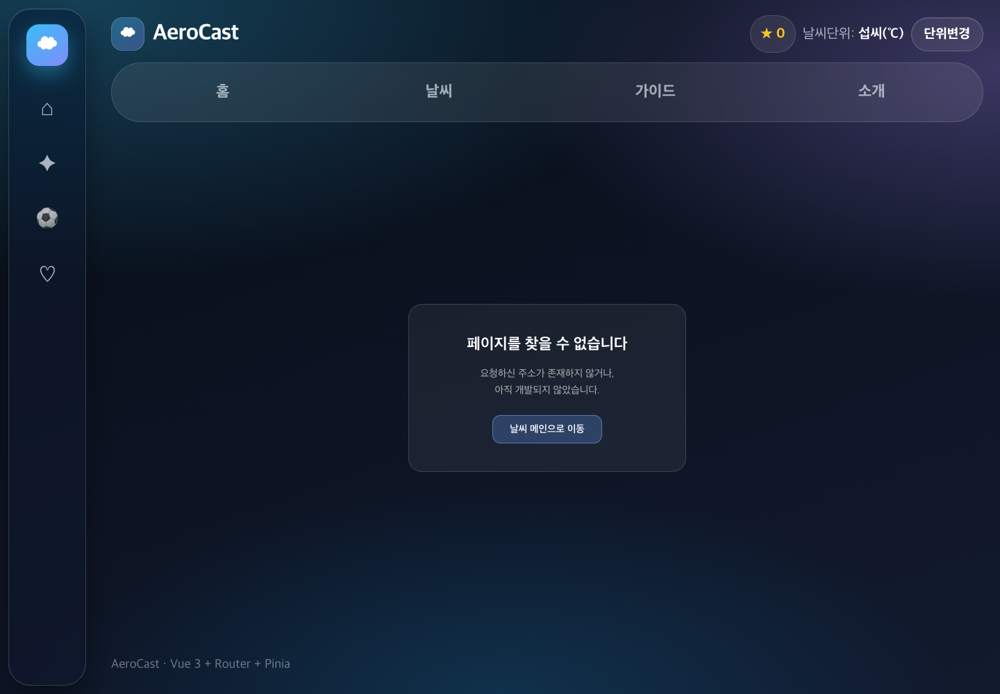

### 10. 단위 변경 (화씨)

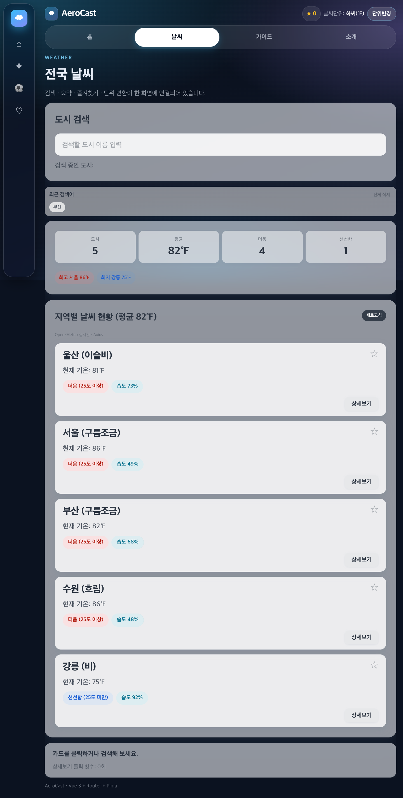

### (백업) 3일차 기준 스냅샷

| 설명 | 파일 |
|------|------|
| 홈 | `screenshots/d345-01-home.png` |
| 날씨 | `screenshots/d345-02-cities.png` |
| 검색 | `screenshots/d345-03-search-query.png` |
| 상세 | `screenshots/d345-04-detail.png` |
| 소개 | `screenshots/d345-05-about.png` |
| 가이드 | `screenshots/d345-06-guide.png` |
| 404 | `screenshots/d345-07-404.png` |
| 화씨 | `screenshots/d345-08-unit-fahrenheit.png` |
| 즐겨찾기 | `screenshots/d345-09-favorite.png` |

---

## 본인 아이디어 / 보너스 포인트

1. **사이드 레일 도킹 UI** — 드래그 + 호버 확장 (Vue 상태·이벤트)
2. **대시보드 카드 드래그 정렬** — 컴포넌트 조합 + localStorage
3. **날씨 캐릭터 누비** — Composition 기반 상태 → SVG 모션
4. **운동 뉴스 · 건강 허브** — Axios로 공개 API 연동 + 캐러셀
5. **Groq 챗봇** — 환경변수 키 관리 (프론트 노출 주의, `.env` 미커밋)
6. **Open-Meteo 한도 대응** — 캐시 · wttr 폴백 · 7일 예보 보충

---

## 제출 zip 체크리스트

- [ ] `node_modules` **삭제** 후 zip
- [ ] 파일명: `울산4반_Vue_4일차_종합실습제출_박연제.zip`
- [ ] `README.md` + 스크린샷 포함
- [ ] `.env` / 키 파일 **미포함** (`.env.example`만)
- [ ] 채점자: `npm install` → `npm run dev` 가능
- [ ] README에 **배포 URL** 기입
- [ ] 개인 구글 드라이브 폴더에 업로드

드라이브: [울산4반_Vue_4일차_종합실습제출](https://drive.google.com/drive/folders/1ODK-A1lh17Vm09_g-4mJ4JAlHug7czJg?usp=drive_link4)

---

## 라이선스 / 참고

- Open-Meteo, ESPN public endpoints, wger.de, Groq — 각 서비스 이용약관 준수
- 수업 교안 Hands on — Weather Refinement / Deployment 기준
